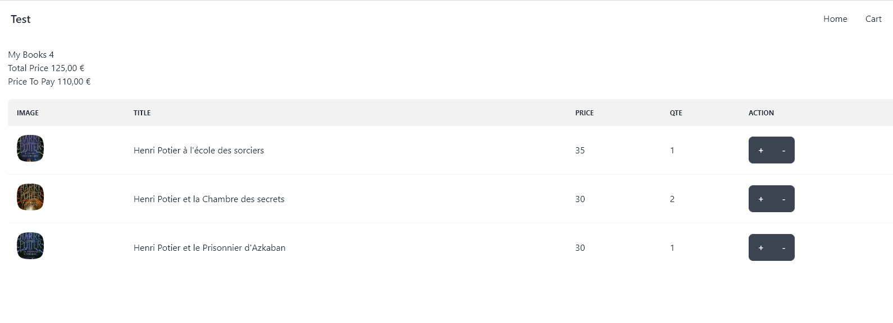

# React Clean Architecture

## Table of Contents

- [About the Project](#about-the-project)
- [Quick Highlights](#quick-highlights) 
- [Screenshot](#screenshot) 
- [Built With](#built-with)
- [Getting Started](#getting-started)
- [License](#license)

### About the Project

> The <b>React Clean Architecture</b> web application presents a custom Clean Architecture for react
>  
> The APP is created with the latest industry standards using React.js, Redux Middleware, Tailwind CSS  and Daisy ui
>  

### Quick Highlights 
> Many of us use various design patterns with React Development to make React Apps more clean, clearly understandable, and more structured. But still we are facing issues with coding standards, we changed at one place and it breaks at another place
> 
><b>React Clean Architecture </b>- which makes your code more structured, clean and anyone can easily take over your code and start working with you.
>Which include everything API, State Management (Redux, Redux Middleware),Storybook, Utilities, Component/Container and you can add more relevant features .

### Screenshot

## Built with Clean Architecture
- Application - Redux
- Views - React
- Infrastructure - Axios

## Other Features
- All business logic resides in Redux Middleware
- Boostraped with `create-react-app`

## Getting Started

**To get this project set up on your local machine, follow these simple steps:**

**Step 1** 
Navigate through the local folder where you want to clone the repository and run 
`https://github.com/ziedak/React-Clean-Architecture.git`. It will clone the repo to your local folder. 
**Step 2** 
Run `cd React-Clean-Architecture` 
**Step 3** 
Run `yarn install` to install the yarn packages from the `package.json` file. 
**Step 4** 
Run `yarn start` to start the webpack server, you can now navigate to `http://localhost:3000` to view the app. The server refreshes the app every time you make a change to a file used by it. 
**Step 5** 
Most important, enjoy the app! 
## Tests
1. Open Terminal
2. Install dependencies (only if you did not install them previously):
   `yarn install`
3. Run the tests with the command:
   `yarn test`

## License
This project is [MIT](https://opensource.org/licenses/MIT) licensed.
## Show your support
If you've read this far....give me a ⭐️!